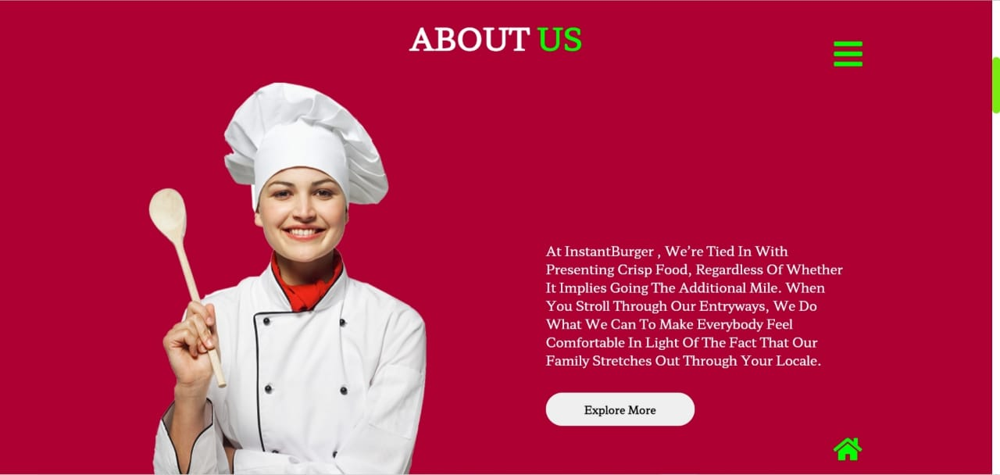
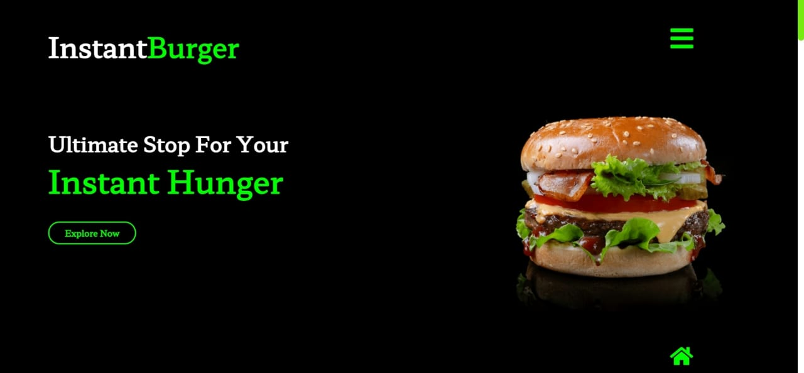
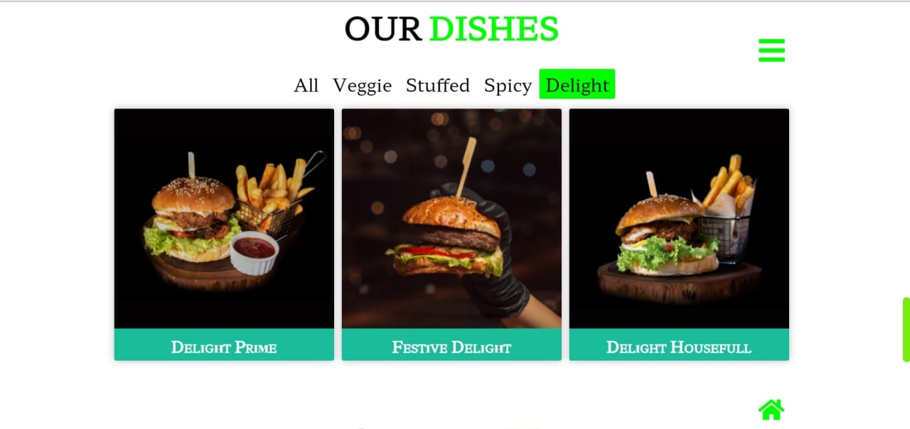
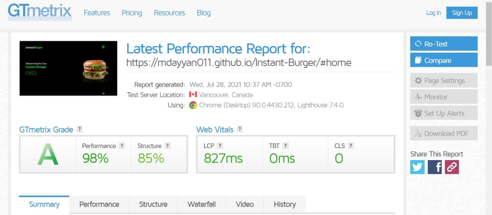

# Instant-Burger
Front-end website designed with love for the hackathon NEXUS.
 
The website is made keeping the format of the hackathon in mind.

Following are some of the screenshots of the website:

 Performance of the website as tested on an online website called GTMetrix 

